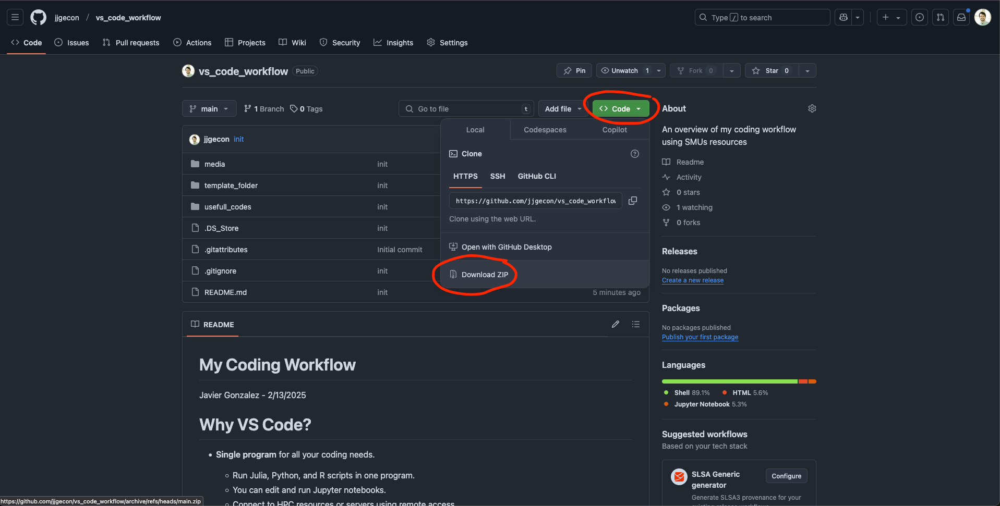

Each notebook explores NLP algorithm techniques using a small dataset of psychologists' responses to patient comments from [Kaggle](https://www.kaggle.com/datasets/thedevastator/nlp-mental-health-conversations?resource=download).

- `nlp_vecs.ipynb` explores [Vector Embeddings](https://platform.openai.com/docs/guides/embeddings) - a way to represent text as numerical vectors.
- `nlp_topics.ipynb` explores [Topic Modeling](https://levity.ai/blog/what-is-topic-modeling) - discovering hidden themes in text collections.
- `nlp_sentiment.ipynb` explores [Sentiment Analysis](https://aws.amazon.com/what-is/sentiment-analysis/) - determining emotional tone in text.
- `nlp_gen_ai.ipynb` explores using proprietary generative text models (OpenAI, Google's Gemini, Anthropic's Claude) and open-source models (Deepseek, Microsoft's phi-4) for categorization tasks. It also demonstrates a simple AI agent prompting framework without function calling.

We use the `openai` package to access their API models. You'll need an OpenAI key by following these [steps](https://platform.openai.com/docs/libraries). Note that API usage requires money in your account. Most calls using `gpt-4o-mini` are inexpensive (under 50 cents), but larger models like `gpt-4o` or `o3` can cost more.

Add your API key to a file named `.env` with this content:

```
OPENAI_API_KEY = "YOUR_API_KEY"
```

We also use [Hugging Face's](https://huggingface.co/) `transformers` package to run generative AI models locally. 

Most models are GPU-intensive, so consider connecting to the SuperPod HPC for running larger models.

More details are available in each notebook.

# [`uv`](https://docs.astral.sh/uv/) Setup

This project uses the [`uv`](https://docs.astral.sh/uv/) Python package manager. Follow the [installation steps](https://docs.astral.sh/uv/getting-started/installation/) to get started.

To create and activate your virtual environment, run these commands in the main project directory:
```bash
uv venv
uv sync
```

Setting up the environment may take some time due to large packages like `tensorflow` and `transformers` used for generative AI.

# Running Notebooks

You will need to clone this repository:

1. Go to [https://github.com/jjgecon/NLP_notes](https://github.com/jjgecon/NLP_notes).
2. Select `Code` → `Download ZIP`.
    <div align="center">
        
    </div>

    > Alternatively, you can clone the repository using the terminal or [GitHub Desktop](https://desktop.github.com/download/).
3. Unzip the files to your desired location.

## VS Code (Recommended)

Open VS Code in the folder containing the `.venv` folder (which might be hidden).

VS Code should automatically detect the kernel in the virtual environment. 

To verify, check the top-right corner of the notebook for the kernel indicator. It should show Python from `.venv/bin/activate`. If using another environment, select "Select Another Kernel" and find the one with this path.

## Jupyter Notebook Server

Run this command in your terminal from the repository directory:

```shell
uv run --with jupyter jupyter lab
```

This will start a Jupyter Lab session in your browser using the virtual environment.

## SMU Superpod

To access SMU's High Performance Computing (HPC), you need an account with ColdFront Allocation access. The Office of Information Technology has [documentation](https://southernmethodistuniversity.github.io/hpc_docs/coldfront/quick_start.html) on using ColdFront and requesting resources.

Students may need to ask their advisor or graduate director for an allocation.

> Note: HPC access requires a connection to the SMU network, possibly through VPN.

You'll need a GPU allocation. Use the `interactive_superpod_resources.bash` script provided.

**BEFORE** running any scripts, replace YOUR_ALLOCATION with your ColdFront allocation. See the [documentation](https://southernmethodistuniversity.github.io/hpc_docs/coldfront/qs_student.html) for finding your allocation name.

A good default setup is: 1 CPU node, 1 GPU (80GB VRAM), 64GB RAM for 2 hours:

```shell
srun -A YOUR_ALLOCATION -N1 -G1 --mem=64gb --time=2:00:00 --pty \$SHELL
```

You'll also need to activate CUDA modules:

```shell
module load gcc/13.2.0 cuda/12.4.1-vz7djzz cudnn/9.1.1.17-12-ld5h22c
```

### Starting the Jupyter Server

The `run_jupyter.bash` script creates a Jupyter server in a `tmux` session:

```shell
bash run_jupyter.bash nlp_start
> Session nlp_start started and running in background
> To attach to the session: tmux attach-session -t nlp_start
```

The first argument (`nlp_start`) is the session name, which you can change.

To enter your `tmux` session, copy and paste the provided command (e.g., `tmux attach-session -t nlp_start`).

To connect from your computer to this Jupyter server, you'll need to set up a proxy in your browser. Instructions are available in this [lecture](https://vuminhtue.github.io/SMU_SuperPOD_101/04-Using%20JupyterLab/index.html).

### VS Code with HPC (Recommended)

For connecting VS Code to the HPC, see this [repository](https://github.com/jjgecon/vs_code_workflow).

- Copy the Jupyter server link from the `tmux` session as shown below:
    <div align="center">
        
    </div>
- Go to the top-right corner to select the notebook's kernel
- Click "Select Kernel" → "Existing Jupyter Server...", paste the link, and press Enter
    > If one link doesn't work, try the alternative link
- Select "Python 3 (ipykernel)"
