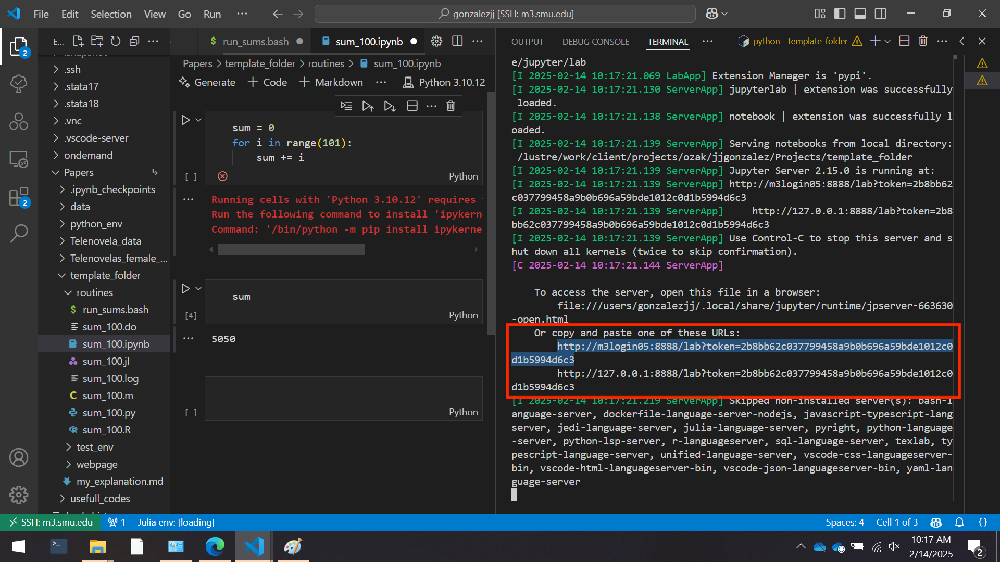

The are two notebooks that explore the most important NLP algorithms with a small dataset of XXXXXXXX.

`nlp_101.ipynb` explores the following concepts

- `nlp_vecs.ipynb` explores [Vector Embeddings](https://platform.openai.com/docs/guides/embeddings)
- `nlp_topics.ipynb` explores [Topic Modeling](https://levity.ai/blog/what-is-topic-modeling)
- `nlp_sentiment.ipynb` explores [Sentiment Analysis](https://aws.amazon.com/what-is/sentiment-analysis/)
- `nlp_gen_ai.ipynb` explores how using propiatary generative text models (e.g OpenAI, Google's Gemini, or Anthropic's Claude) and open-source models (e.g. Deepseek or Microsoft's phi-4) for categorization tasks. 

We will use `openai` package and call on the API to the models. For this you will need a OpenAI key. Please follow these [steps](https://platform.openai.com/docs/libraries) with your OpenAI account to create a key. Note, that when using the API you need some money in the account. Most of the call using the `gtp-4o-mini` will be inexpensive (<50 cents). However, for bigger models like `gpt-4o` or thinking models `o3` can be more expensive.

Now, add the key to file `.env`. This file should have the following inside:

```
OPENAI_API_KEY = "YOUR_API_KEY"
```

We will use [huggingface](https://huggingface.co/) `transformers` package that allows us to run generative ai models on our machine. 

Mst of the models are GPU intensive, so I recommend that if you want to use bigger models to connect to the SuperPod HPC.

More details will be avaiable in each part of the notebook

# [`uv`](https://docs.astral.sh/uv/) set up

This notebook uses the [`uv`](https://docs.astral.sh/uv/) python package manager. To use it please follow the [instalation steps](https://docs.astral.sh/uv/getting-started/installation/).

To activate your virtual environment just run in the main directory of this project.
```bash
uv sync
```

The environment will take some time to build, mainly because of big packages such as `tensorflow` and `transformers` used in generative AI.

# Using the Notebook

To run the local models in `nlp_101.ipynb` you will need to install a CUDA library? (test in own computer)

However, if you plan to run bigger models than what we will see in `nlp_gen_ai.ipynb`, you might need to have dedicaded GPUs in your computer to run.

Having said that, please follow the nest instructions to access the notebooks.

## VS Code (Recommended)

Open VS Code in the folder with the `.venv` folder (this folder might be hidden from you).

VS Code should have automatically detected the kernel in the virtual environment. 

To check, go to the top-right corner of to inspect the notebook's kernel. Select and it should be the python with address `.venv/bin/activate`. If you have another environment, select -> "Select Another Kernel" and find the one with the previous address.

## Juputer notebook server

Simply run in your terminal (make sure you are in the directory of this repo)

```shell
uv run --with jupyter jupyter lab
```

And your jupyter lab session will run with the virtual environment in youir browser.

## SMU Superpod

To access SMU's HPC, you need to have an account with access to a ColdFront Allocation. The OIT has generated some [documentation](https://southernmethodistuniversity.github.io/hpc_docs/coldfront/quick_start.html) on how to use ColdFront and request storage and allocation resources.

As a student, you might need to ask your Advisor or Dr. Sposi to give you an allocation.

> You can only access the HPC while connected to the SMU network. You could do it through a VPN, but I haven't tried that yet.

You would need to get an allocation with working **GPU**. For this I have prepared `interactive_superpod_resources.bash`.

These scripts will ask for some information about how many CPU, GPU, memory, and time you need to run an interactive job.

**BEFORE** running any of the scripts, you need to change the YOUR_ALLOCATION within the scripts with the ColdFront allocation. See the [documentation](https://southernmethodistuniversity.github.io/hpc_docs/coldfront/qs_student.html) to find your allocation name.

A good default allocation is 1 CPU node, with 1 GPU (with 80gb of video memory), 64gb of RAM and open for 2 hours. Feel free to use the interactive code or change the values from the shell bellow.

```shell
srun -A YOUR_ALLOCATION -N1 -G1 --mem=64gb --time=2:00:00 --pty \$SHELL
```

You will also need to activate the CUDA modules: 

```shell
module load gcc/13.2.0 cuda/12.4.1-vz7djzz cudnn/9.1.1.17-12-ld5h22c
```

### Start the Jupyter Server

The bash script called `run_jupyter.bash` creates a jupyter server in a `tmux` session. To run it just

```shell
bash run_jupyter.bash nlp_start
> Session nlp_start started and running in background
> To attach to the session: tmux attach-session -t nlp_start
```

The code is made so that the first argument (`nlp_start`) will be that name of the session. So feel free to change this.

To enter your `tmux` session just copy and paste the provided `tmux attach-session -t nlp_start` where you will see the jupyter server.

If you want to connect from your computer to this jupyter server you would need to set up a `proxy` your browsers. On this [lecture](https://vuminhtue.github.io/SMU_SuperPOD_101/04-Using%20JupyterLab/index.html) you can find the steps to connect to the server.

### VS Code (Recommended)

For more information on how to connect VS Code to the HPC please see this [repository](https://github.com/jjgecon/vs_code_workflow).

- Copy the link in the Jupyter server in the `tmux` session as seen below:
    <div align="center">
        
    </div>
- Go to the top-right corner of to select the notebook's kernel.
- At the top, press `Select Kernel` → `Existing Jupyter Server...`, and paste the link and press enter.
    > If one link does not work, try to use the other link.
- Select the `Python 3 (ipykernel)`.
